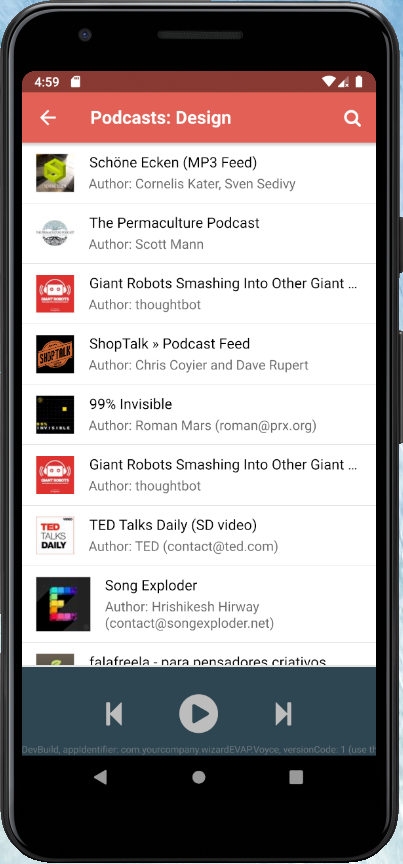
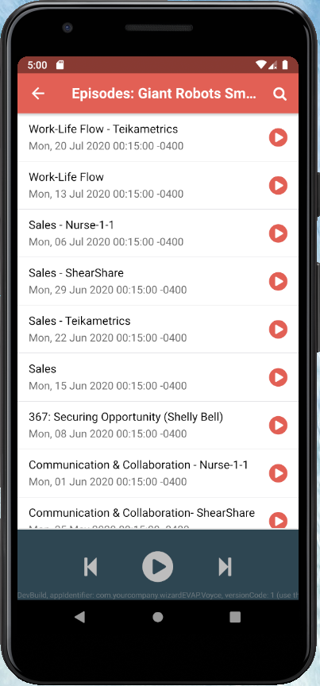
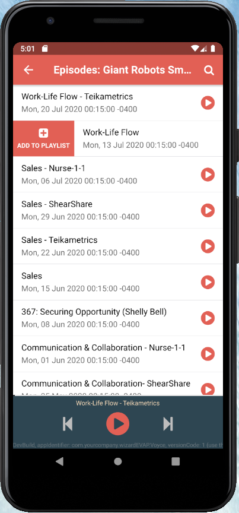
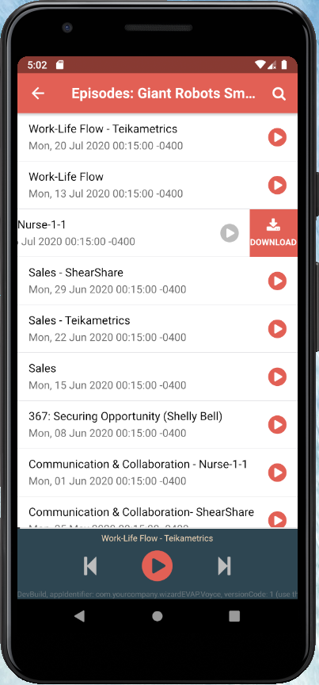
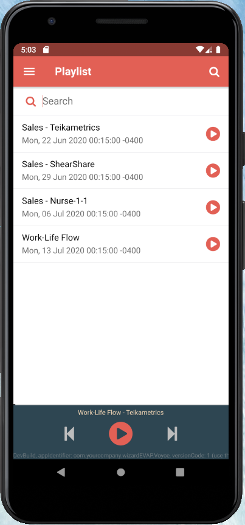

# Voyce

## Simple Android/iOS/Desktop application for streaming Podcasts, based on Felgo SDK, Qt and QML

### How it Works?
It is basically just a [gpodder](https://gpodder.net/) client. Fetches podcasts directory data which is displayed in UI.  
API documentation for the service is [here](https://gpoddernet.readthedocs.io)

### How can I set it up?  
Tutorial for how the Felgo SDK and Qt can be set up on your machine, is provided as HTML guide.  
Just clone this repo, navigate to **doc/html** directory, and open **index.html** in your browser.

## Screenshots

